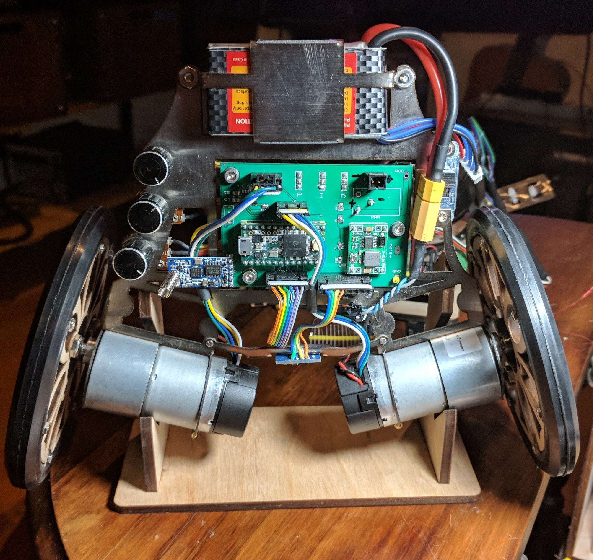
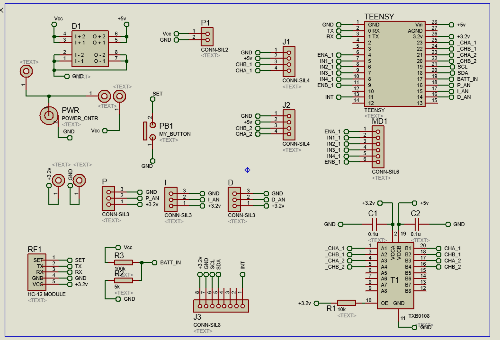

# minderwertigBot

## About the code

[](docs/minderwertigBot.jpg)

### Repository Structure
 * **shared_lib**: files used by joystick and robot
 * **joystick**: code for joystick
 * **robot**: code for robot
 * **docs**: documentation

### Structure for joystick and robot directories
 * **lib**: not used
 * **platformio.ini**: a config file used by platformio
 * **src**: firmware code

### To get going:
* install platformio
* connect your usb to the teensy. 
* cd into either joystick or robot
* change the line in platformio.ini for upload_port for your usb connection:  
  `upload_port = /dev/cu.usbmodem3918201`
(you might also be able to just comment out that line, platformio is pretty good at finding the right port)

To perform compile and flash:  
`$ pio run`

You might need to install some libraries, the platformio compiler will let you know. When you install them be sure to use the platformio lib command. To learn about lib stuff type:

`$ pio lib`

## Running the bot

Right now the bot is configured to receive commands from the joystick via button presses and one of the potentiometers. Connect up the crappy battery connector. For some reason the connection at that connector is not always perfect. There's a switch on the bot to drive the motors - the light on the teensy always flashes regardless of switch position. Pressing the buttons rotate the wheels. The potentiometer sets the speed.

The IMU for the bot is located at the bottom of the frame. It is placed there because I read IMUs should be put as close to the rotating axis of the bot as possible. 

### The circuit

This is a double-sided [PCB](docs/board.png) with a mounted teensy 3.2. Teensy boards are really nice, their pinouts are described here: [[link](https://www.pjrc.com/teensy/card7a_rev1.png)]. Note that the teensy uses 3.2v inputs so a TXB0108 voltage-level translator is used to manage the signal levels into the encoders.  

Serial communications are run via an HC-12 module, next time I would really rather use a NRF24L01. Youre welcome to change the HC-12's configs if you need to but I think they're tedious. Baud rate 57600 which is supposed to be a reasonable comprimise between speed and fidelity.

[](docs/circuit.png)

The circuit is [here](docs/circuit.PDF). Connector MD1 connects to the input of [L298N](docs/LM298n.jpg) H-bridge Motor Controller. Pin connections are as shown in the circuit diagram. Notice there is a voltage divider on pin 17 that will allow you to read the voltage level of the battery. J1 and J2 handle input from the encoders. minderwertigBot's accelerometer module is a MPU6050 and connects through J3. By the way there are a lot of other inexpensive IMUs out there if you want to try something else. 

### About the code

I have tested this MPU6050 module using this bot but I dont have an example in the current build. I believe this code works without problems:

https://github.com/jrowberg/i2cdevlib/tree/master/Arduino/MPU6050

flash that code, send the output to a serial window and take a look at the results. Just remember: you're collecting digital data from an external circuit board - it's not like there could be major problems with noise, right? 

**joystick/slave.ino:** the only thing that's really interesting about this code is that it collects up the state of the buttons and potentiometers, loads a packet into serialBuf, and sends data to the master via:  

`HC12.write((uint8_t*) serialBuf, packetLen);`

I am sure there are more efficient ways to do serial communication. I try to avoid to have the slave constantly sending signals unless it's receivied a command from the master. This is managed through the `packetReceived()` function.

**robot/robot.ino:** is not even set up like a state machine. It just loops. When  

`while((serialNow - serialDelta) > serialInterval) == True` 

it issues a command to the slave to report. Note, the construction of that while() statement is non-blocking - so higher speed activities in the loop like balancing should be possible. Right now the only thing that happens in the loop is when `receiveCMD() == True` then it loads up the values from serial and performs actions like a print to the usb serial, and sending commands to the motor driver. The potentiometers in the bot were meant to allow the user to manually set PID. Values from the pots are collected with these commands:

```
  P_val = 1024 - analogRead(P_IN);
  I_val = 1024 - analogRead(I_IN);
  D_val = 1024 - analogRead(D_IN);
```
Collecting values for PID seemed like an easy way to do PID tuning without having to recompile code each time, and is a strategy developed [here](https://github.com/IdleHandsProject/thePIDDYBOT). Was I able to make it work? No, of course not. I believe I could not get it to work for at least two reasons. One, because my heart is impure. The other reason is I notice that virtually all balance bots have very light wheels. I wonder if the combination of minderwertigBot's heavy wheels, with even more inertial wieght of the gearing results in lot of interia in the overall drive train, and impacts how responsive the whole system can be to staying upright. Perhaps smarter minds and purer hearts will prevail. 